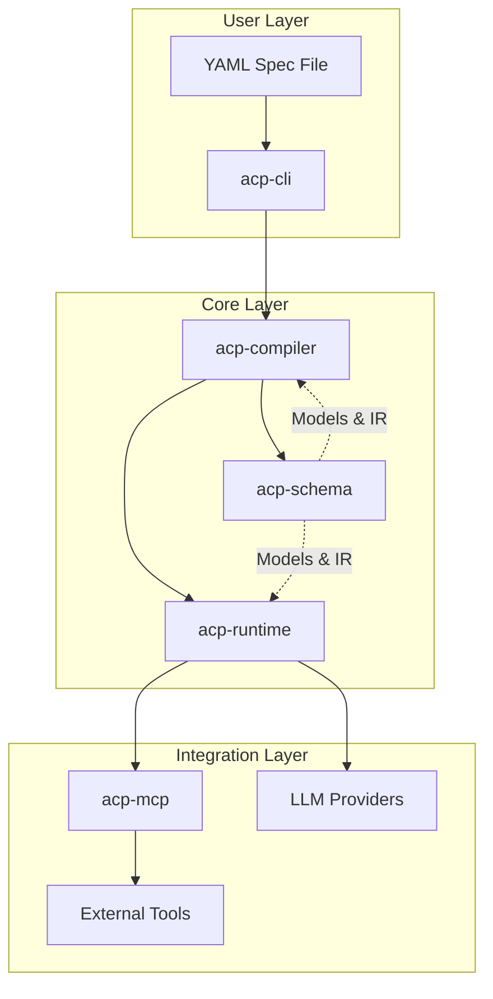

<p align="center">
  <h1 align="center">ACP</h1>
  <p align="center"><strong>Agent as Code Protocol</strong></p>
  <p align="center">A declarative framework for defining AI agent systems using YAML</p>
</p>

<p align="center">
  <a href="#installation"></a>
  <a href="LICENSE"></a>
  <a href="#features"></a>
</p>

---

## What is ACP?

**ACP (Agent as Code Protocol)** is a declarative framework that lets you define, configure, and orchestrate AI agent systems using simple YAML specifications. Instead of writing imperative code to manage agents, prompts, and workflows, you describe *what* you want in a structured configuration file, and ACP handles the *how*.

Think of it as **Infrastructure as Code, but for AI agents**. Define your agents, their capabilities, policies, and workflows in version-controlled YAML files, then execute them with a single command.

### Why ACP?

- **Declarative**: Focus on what your agents should do, not how to wire them together
- **Reproducible**: Version-control your agent configurations alongside your code
- **Composable**: Build complex multi-agent systems from simple, reusable components
- **Safe**: Built-in policy enforcement for budgets, timeouts, and approval gates
- **Extensible**: Connect to external tools via MCP (Model Context Protocol) servers

## Features

- **YAML-First Configuration** — Define agents, workflows, and policies in human-readable YAML
- **Multi-Provider Support** — Use OpenAI, Anthropic, or other LLM providers interchangeably
- **Multi-Agent Orchestration** — Coordinate multiple specialized agents with conditional routing
- **MCP Integration** — Connect to external tools and APIs via Model Context Protocol servers
- **Policy Enforcement** — Set budgets, timeouts, and capability limits per agent
- **Human-in-the-Loop** — Built-in approval gates for sensitive operations
- **Execution Tracing** — Full visibility into workflow execution for debugging
- **CLI Interface** — Validate specs and run workflows from the command line

## Installation

### Prerequisites

- Python 3.12 or higher
- [Poetry](https://python-poetry.org/) for dependency management

### Quick Install

```bash
# Clone the repository
git clone https://github.com/your-org/acp.git
cd acp

# Install with Poetry
cd acp-cli
poetry install

# Verify installation
poetry run acp --help
```

### Development Setup

For development, install all packages in editable mode:

```bash
# Install each component
cd acp-schema && poetry install && cd ..
cd acp-mcp && poetry install && cd ..
cd acp-compiler && poetry install && cd ..
cd acp-runtime && poetry install && cd ..
cd acp-cli && poetry install && cd ..
```

### Environment Variables

Set up your LLM provider API keys:

```bash
export OPENAI_API_KEY="your-openai-key"
export ANTHROPIC_API_KEY="your-anthropic-key"

# For MCP servers (e.g., GitHub)
export GITHUB_PERSONAL_ACCESS_TOKEN="your-github-token"
```

## Quick Start

### 1. Create a Simple Agent

Create a file called `my-agent.yaml`:

```yaml
version: "0.1"

project:
  name: my-first-agent

providers:
  llm:
    openai:
      api_key: env:OPENAI_API_KEY
      default_params:
        temperature: 0.7
        max_tokens: 2000

policies:
  - name: default
    budgets:
      max_cost_usd_per_run: 0.50
      timeout_seconds: 60

agents:
  - name: assistant
    provider: openai
    model:
      preference: gpt-4o-mini
      fallback: gpt-4o
    instructions: |
      You are a helpful assistant. Answer questions clearly and concisely.
    allow: []
    policy: default

workflows:
  - name: ask
    entry: process
    steps:
      - id: process
        type: llm
        agent: assistant
        input:
          question: $input.question
        save_as: answer
        next: end

      - id: end
        type: end
```

### 2. Validate Your Spec

```bash
cd acp-cli
poetry run acp validate ../my-agent.yaml
```

### 3. Run the Workflow

```bash
# With inline input
poetry run acp run ask --spec ../my-agent.yaml --input '{"question": "What is the capital of France?"}'

# Or interactively (prompts for missing inputs)
poetry run acp run ask --spec ../my-agent.yaml
```

## Architecture

ACP is built as a modular monorepo with five core packages:



### Package Overview

| Package | Description |
|---------|-------------|
| **acp-schema** | Core Pydantic models for YAML specs and Intermediate Representation (IR) |
| **acp-compiler** | Parses YAML, validates specs, and generates IR for the runtime |
| **acp-runtime** | Workflow execution engine with LLM integration and policy enforcement |
| **acp-mcp** | MCP (Model Context Protocol) client for connecting to external tool servers |
| **acp-cli** | Command-line interface for validating and running workflows |

### How It Works

1. **Define**: Write your agent configuration in YAML
2. **Compile**: The compiler validates your spec and generates an Intermediate Representation
3. **Execute**: The runtime processes the IR, coordinating agents, LLM calls, and external tools
4. **Enforce**: Policies are checked at each step for budgets, timeouts, and approvals

## Examples

The `examples/` directory contains ready-to-use configurations:

### Simple Agent (`simple-agent.yaml`)
A basic question-answering agent using OpenAI.

```bash
poetry run acp run ask --spec examples/simple-agent.yaml
```

### Multi-Agent Router (`multi-agent.yaml`)
Demonstrates conditional routing between a fast responder and a deep analyst based on task complexity.

```bash
poetry run acp run smart_respond --spec examples/multi-agent.yaml --input '{"task": "Explain quantum computing"}'
```

### PR Reviewer (`pr-reviewer.yaml`)
A GitHub PR reviewer that uses MCP to fetch PR data and post reviews with human approval gates.

```bash
poetry run acp run review_pr --spec examples/pr-reviewer.yaml \
  --input '{"owner": "your-org", "repo": "your-repo", "pr_number": 123}'
```

### Filesystem Agent (`filesystem-agent.yaml`)
An agent with filesystem access via MCP server integration.

## Usage

### CLI Commands

#### Validate a Specification

```bash
acp validate <spec-file>

# Examples
acp validate my-agents.yaml
acp validate examples/simple-agent.yaml
```

#### Run a Workflow

```bash
acp run <workflow-name> [options]

Options:
  -s, --spec PATH        Path to YAML spec file (default: acp.yaml)
  -i, --input JSON       Input data as JSON string
  -f, --input-file PATH  Input data from JSON file
  -o, --output PATH      Write output to file
  -t, --trace PATH       Write execution trace to file
  -v, --verbose          Enable verbose output
```

**Examples:**

```bash
# Basic run
acp run ask --spec my-agent.yaml

# With JSON input
acp run ask --spec my-agent.yaml --input '{"question": "Hello!"}'

# From input file
acp run ask --spec my-agent.yaml --input-file input.json

# Save output and trace
acp run ask --spec my-agent.yaml -o result.json -t trace.json -v
```

## Configuration Reference

### YAML Spec Structure

```yaml
version: "0.1"

project:
  name: my-project

providers:
  llm:
    openai:
      api_key: env:OPENAI_API_KEY
      default_params:
        temperature: 0.7
        max_tokens: 2000

servers:                    # Optional: MCP servers
  - name: github
    type: mcp
    transport: stdio
    command: ["npx", "@modelcontextprotocol/server-github"]
    auth:
      token: env:GITHUB_PERSONAL_ACCESS_TOKEN

capabilities:               # Optional: Map server methods
  - name: get_pr
    server: github
    method: get_pull_request
    side_effect: read
    requires_approval: false

policies:
  - name: default
    budgets:
      max_cost_usd_per_run: 1.00
      max_capability_calls: 10
      timeout_seconds: 120

agents:
  - name: my-agent
    provider: openai
    model:
      preference: gpt-4o-mini
      fallback: gpt-4o
    params:
      temperature: 0.5
    instructions: |
      Your agent instructions here...
    allow: [get_pr]         # Allowed capabilities
    policy: default

workflows:
  - name: my-workflow
    entry: first-step
    steps:
      - id: first-step
        type: llm
        agent: my-agent
        input:
          data: $input.data
        save_as: result
        next: end

      - id: end
        type: end
```

### Step Types

| Type | Description |
|------|-------------|
| `llm` | Execute an LLM call with a specified agent |
| `call` | Call an external capability via MCP |
| `condition` | Branch based on state evaluation |
| `human_approval` | Pause for human approval/rejection |
| `end` | Terminate the workflow |

### Variable References

- `$input.field` — Access input data
- `$state.step_id` — Access saved step results
- `$state.step_id.field` — Access nested result fields

## Contributing

We welcome contributions! Here's how to get started:

### Development Workflow

1. **Fork** the repository
2. **Clone** your fork locally
3. **Create a branch** for your feature/fix
4. **Install** dependencies with Poetry
5. **Make changes** and add tests
6. **Run tests** to ensure everything works
7. **Submit** a pull request

### Code Style

- Follow PEP 8 guidelines
- Use type hints for all functions
- Write docstrings for public APIs
- Keep functions focused and small

### Running Tests

```bash
# Run tests for a specific package
cd acp-runtime
poetry run pytest

# Run with coverage
poetry run pytest --cov=acp_runtime
```

### Reporting Issues

Found a bug or have a feature request? Please [open an issue](https://github.com/your-org/acp/issues) with:

- Clear description of the problem or feature
- Steps to reproduce (for bugs)
- Expected vs actual behavior
- Your environment (Python version, OS)

## Roadmap

- [ ] Web UI for workflow visualization
- [ ] Additional LLM provider support (Gemini, Ollama)
- [ ] Workflow composition and imports
- [ ] Parallel step execution
- [ ] Cost tracking and analytics
- [ ] Plugin system for custom step types

## License

This project is licensed under the MIT License - see the [LICENSE](LICENSE) file for details.

---

<p align="center">
  <strong>Built with ❤️ for the AI agent community</strong>
</p>

